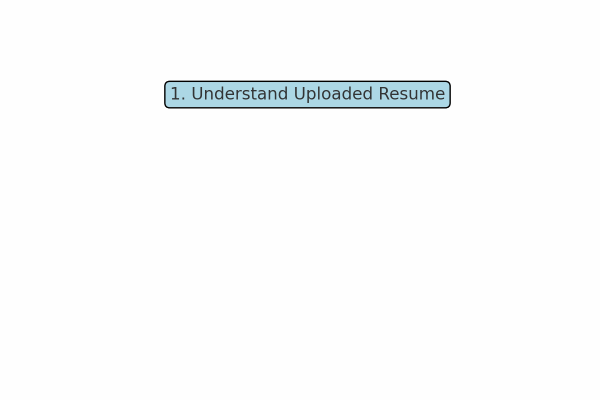

# Welcome to the JobAgent Application

This application allows you to search, match and preparation of your resume for the jobs.

## How It Works

1. The application first understands uploaded resume.
2. Then it lets you collect jobs from various internet sources.
3. Later application tells what is missing in your resume and what matches from your resume against the job requirements.
4. At the end it also helps you how your resume can be updated if you qualify the relevant jobs.

## Process Flow

## Get Started

Use the navigation on the left to switch between different sections.
